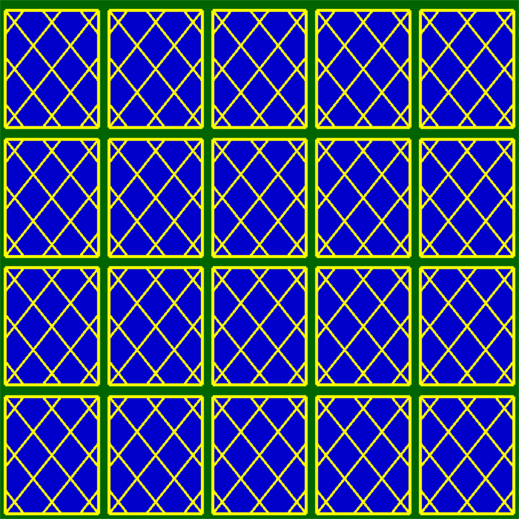
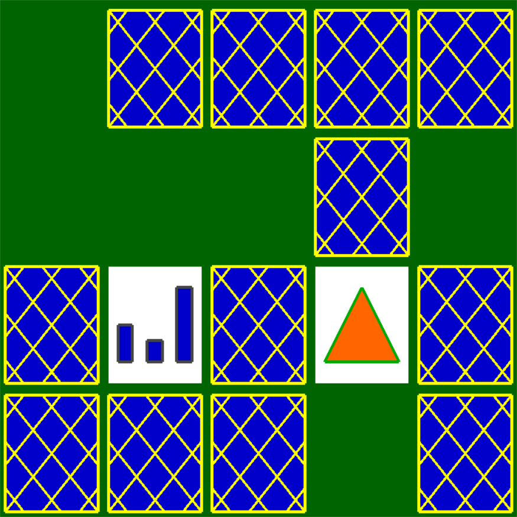

<!--
*** Thanks for checking out the Best-README-Template. If you have a suggestion
*** that would make this better, please fork the repo and create a pull request
*** or simply open an issue with the tag "enhancement".
*** Thanks again! Now go create something AMAZING! :D
-->

<!-- PROJECT SHIELDS -->
<!--
*** I'm using markdown "reference style" links for readability.
*** Reference links are enclosed in brackets [ ] instead of parentheses ( ).
*** See the bottom of this document for the declaration of the reference variables
*** for contributors-url, forks-url, etc. This is an optional, concise syntax you may use.
*** https://www.markdownguide.org/basic-syntax/#reference-style-links
-->

<!-- PROJECT LOGO -->
 
  <h3 align="center">Card Match</h3>

  

    A card match game implimented using OpenGL.
     
    <a href="https://github.com/blakemardon/Card-Match-Game"><strong>Explore the docs »</strong></a>
  

<!-- TABLE OF CONTENTS -->

  
Table of Contents

  <ol>
    <li>
      <a href="#about-the-project">About The Project</a>
      <ul>
        <li><a href="#built-with">Built With</a></li>
      </ul>
    </li>
    <li><a href="#getting-started">Getting Started</a></li>
    <li><a href="#usage">Usage</a></li>
    <li><a href="#license">License</a></li>
    <li><a href="#contact">Contact</a></li>
  </ol>

<!-- ABOUT THE PROJECT -->
## About The Project

This project was a final project for our graphics programming class. The intent was to display proficiency with the OpenGL library with respect to drawing shapes on the screen as well as maintaining game logic. It was decided early in the project that implimenting a 2D drawing system with depth and event handeling would be nessisary to make the project easy to maintain. A depth is applied to all drawable objects and clicking can be added to any object that inherits from the provided clickable class. Along with this text was made easier to display and the default functions for selecing colors were expanded upon.

### Built With

* [OpenGL](https://www.opengl.org/)

<!-- GETTING STARTED -->
## Getting Started

This project requires OpenGL to run. To compile opengl headers must be downloaded and referenced. [Tutorial.](https://www.absingh.com/opengl/)

<!-- USAGE EXAMPLES -->
## Usage

Upon starting the game rows and columns of cards will be displayed. Clicking a card will reveal it. The goal is to match each card with the the other card that has the same symbol on it.

<!-- LICENSE -->
## License

Distributed under the MIT License.

<!-- CONTACT -->
## Contact

BlakeMardon - BlakeMardon@gmail.com

Project Link: [https://github.com/blakemardon/Card-Match-Game](https://github.com/blakemardon/Card-Match-Game)

